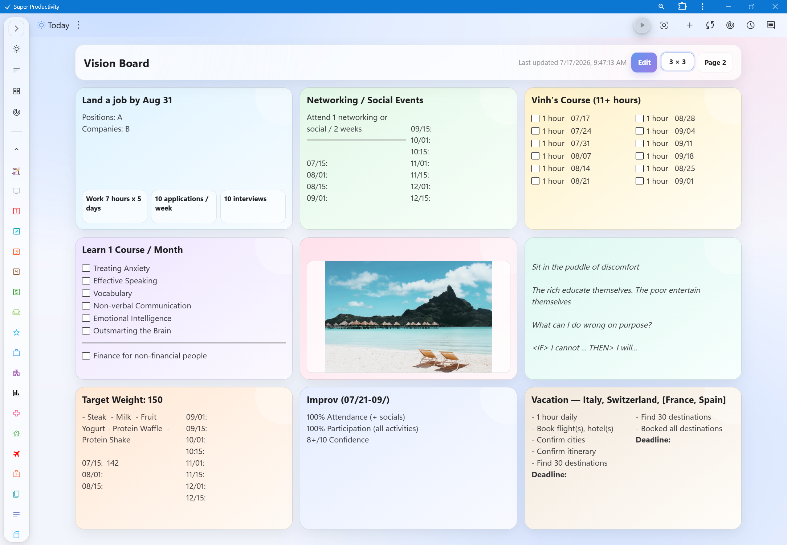
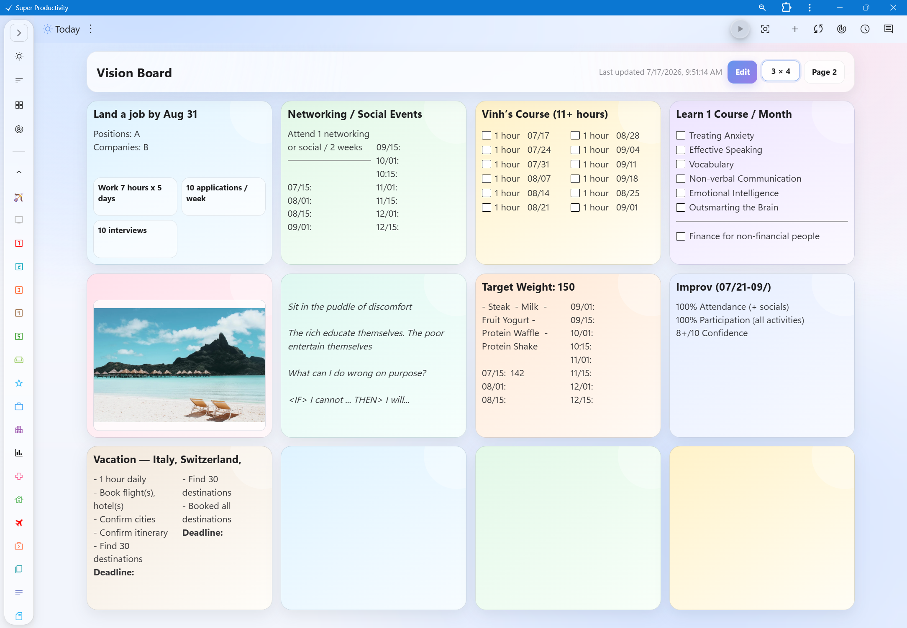
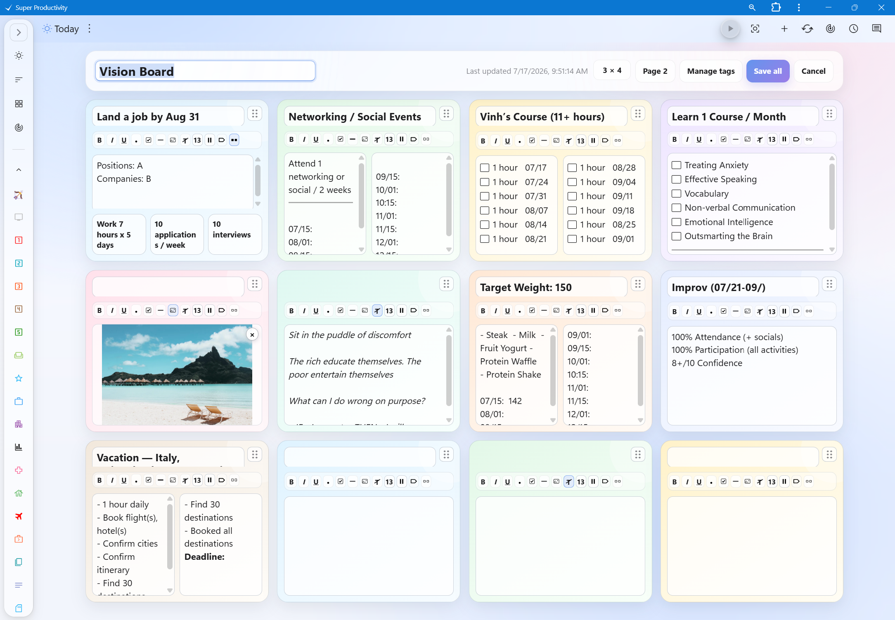

# vision-board-super-productivity
A customizable visual board plugin for long term goals, reminders, and notes
# Goals Vision Board for Super Productivity

A customizable two-page goals dashboard for Super Productivity.

## Features

- Up to 15 persistent goals per page
- Multiple row × column arrangements
- Drag-and-drop box ordering
- Rich-text descriptions
- Bullets and interactive checklists
- Horizontal dividers
- Custom reusable tags
- Optional lower information boxes
- Independent Page 1 and Page 2 layouts
- Local and synchronized plugin persistence

## Screenshots

### Goals board

### Edit mode

## Installation

1. Open the repository’s **Releases** page.
2. Open the latest release.
3. Under **Assets**, download **`goals-vision-board.zip`**.
4. Do not download **Source code (zip)** or **Source code (tar.gz)**.
5. Open Super Productivity.
6. Go to **Settings → Plugins**.
7. Select **Upload plugin**.
8. Choose `goals-vision-board.zip`.
9. Enable the plugin.
10. Open **Goals** from the Super Productivity header.

> **Important:** The ZIP downloaded through GitHub’s green **Code → Download ZIP** button is the repository source archive and cannot be installed as a Super Productivity plugin.

## Privacy

The plugin does not include or transmit the developer’s saved goals.

Each user’s board content is stored through Super Productivity’s plugin
persistence system in that user’s own environment.

## Compatibility

Requires Super Productivity 14.0.0 or later.

## License

MIT
